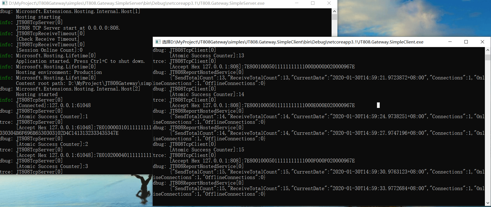
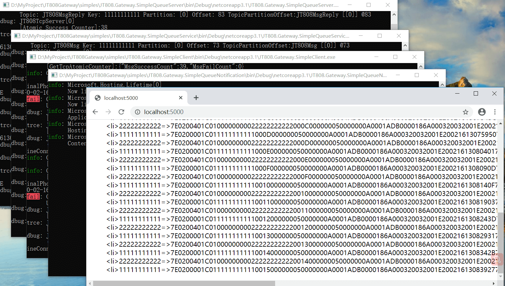

# JT808Gateway

支持TCP/UDP通用消息业务处理

## 集成接口功能

| 接口名称                      | 接口说明                          | 使用场景                                                                                                                                             |
| :---------------------------- | :-------------------------------- | :--------------------------------------------------------------------------------------------------------------------------------------------------- |
| IJT808SessionProducer         | 会话通知（在线/离线）数据生产接口 | 有些超长待机的设备，不会实时保持连接，那么通过平台下发的命令是无法到达的，这时候就需要设备一上线，就即时通知服务去处理，然后在即时的下发消息到设备。 |
| IJT808SessionConsumer         | 会话通知（在线/离线）数据消费接口 | -                                                                                                                                                    |
| IJT808MsgProducer             | 数据生产接口                      | 网关将接收到的数据发送到队列                                                                                                                         |
| IJT808MsgConsumer             | 数据消费接口                      | 将数据进行对应的消息业务处理(例：设备流量统计、第三方平台数据转发、消息日志等)                                                                       |
| IJT808MsgReplyProducer        | 应答数据生产接口                  | 将生产的数据解析为对应的消息Id应答发送到队列                                                                                                         |
| IJT808MsgReplyConsumer        | 应答数据消费接口                  | 将接收到的应答数据下发给设备                                                                                                                         |
| IJT808MsgReplyLoggingProducer | 网关应答数据日志生产接口          | 将网关能解析到直接能下发的数据发送到队列                                                                                                             |
| IJT808MsgReplyLoggingConsumer | 网关应答数据日志消费接口          | 将网关能解析到直接能下发的数据发送到日志系统                                                                                                         |

> 使用物联网卡通过udp下发指令时，存储的那个socket地址端口，有效期非常短,不速度快点下发，那个socket地址端口就可能映射到别的对应卡去了,所以此处采用跟随设备消息下发指令。

## 基于WebApi的消息业务处理程序

通过继承JT808.Gateway.Handlers.JT808MsgIdDefaultWebApiHandler去实现自定义的WebApi接口服务。

[接口文档](https://github.com/SmallChi/JT808Gateway/tree/master/api)

## 基于Pipeline

Pipeline分为两种方式使用，一种是使用队列的方式，一种是网关集成的方式。

| 使用方式     | 特性                                                                               | 备注                                         |
| :----------- | :--------------------------------------------------------------------------------- | :------------------------------------------- |
| 使用队列     | 网关不需要重启，相当于透传数据，设备上来的数据直接入队列，通过服务去处理消息。     | 设备多的可以这样搞，这样关注点在业务上面。   |
| 使用网关集成 | 网关需要根据消息业务的变化去处理，也就意味着更改业务，需要重启网关，但是上手简单。 | 设备少的，开发能力弱的，允许设备丢点数据的。 |

### Pipeline的NuGet安装

| Package Name                                   | Version                                                                                              | Preview  Version                                                                                        | Downloads                                                                                             |
| ---------------------------------------------- | ---------------------------------------------------------------------------------------------------- | ------------------------------------------------------------------------------------------------------- | ----------------------------------------------------------------------------------------------------- |
| Install-Package JT808.Gateway.Abstractions     |          |          |          |  |
| Install-Package JT808.Gateway                  |                                    |                                    |                                    |
| Install-Package JT808.Gateway.WebApiClientTool |  |  |  |
| Install-Package JT808.Gateway.Client           |                      |                      |                      |
| Install-Package JT808.Gateway.Kafka            |                        |                        |          |

## 举个栗子

### Pipeline

#### 使用网关集成方式

1.打开/simples/JT808.Simples.sln项目进行还原编译生成

2.进入JT808.Gateway.SimpleServer项目下的Debug目录运行服务端

3.进入JT808.Gateway.SimpleClient项目下的Debug目录运行客户端

如图所示：

#### 使用队列方式

1.打开/simples/JT808.Simples.sln项目进行还原编译生成

2.JT808.Gateway.SimpleQueueServer项目下的Debug目录运行服务端

3.JT808.Gateway.SimpleQueueService项目下的Debug目录运行消息处理服务

4.JT808.Gateway.SimpleQueueNotification项目下的Debug目录运行WebSocket服务
从浏览器中打开localhost:5000查看数据

5.进入JT808.Gateway.SimpleClient项目下的Debug目录运行客户端

> 注意：需要安装kafka和zookeeper

如图所示：

## Docker

此处以`vscode`为例，使用`vscode`打开当前文件夹

打包镜像

>当前仅打包[`simples/JT808.Gateway.SimpleServer`](simples/JT808.Gateway.SimpleServer)，可根据需求自行更改

- 按下`F1`按键
- 选择运行任务
- 选择打包示例网关镜像

运行容器
- 运行`docker compose up`

使用tcp工具或本项目中的示例项目测试本地`808`端口，

## 常见问题

- 多协议兼容实现思路[点我查看](https://github.com/SmallChi/JT808Gateway/issues/11#issuecomment-727687417)

> 单端口兼容多协议虽然可以实现，但是还是不建议这么做，建议最好是用端口分开，避免不必要的麻烦
